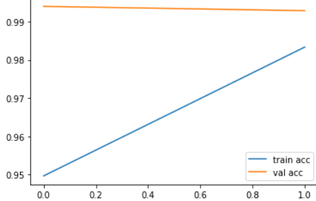
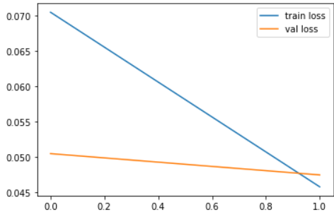

# Identify and classify toxic online comments
[Toxic Comment Classification Challenge](https://www.kaggle.com/c/jigsaw-toxic-comment-classification-challenge/data) from kaggle create a model which predicts a probability of each type of toxicity for each comment with a large number of Wikipedia comments which have been labeled by human raters for toxic behavior (toxic , severe_toxic ,obscene , threat , insult ,identity_hate ) 

  

## Overview

### 1) Import Data

### 2) Tokenize Texts

### 3) Convert texts to sequences

### 4) Pad sequences into same size

### 5) Same sizing sequences

### 6) Deploy Embedding layer and LSTM 

### 7) Testing model 

## Performance

  

  

***loss: 0.0458 - accuracy: 0.9833 - val_loss: 0.0475 - val_accuracy: 0.9929***
